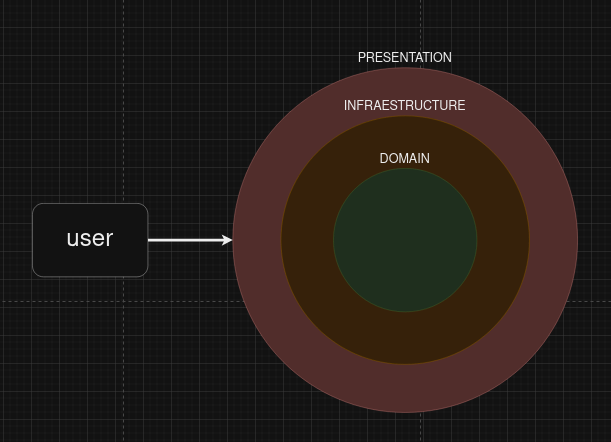
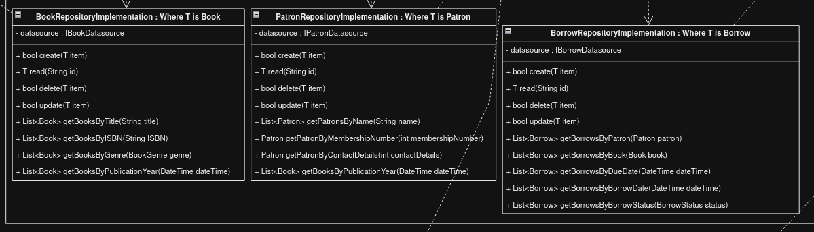
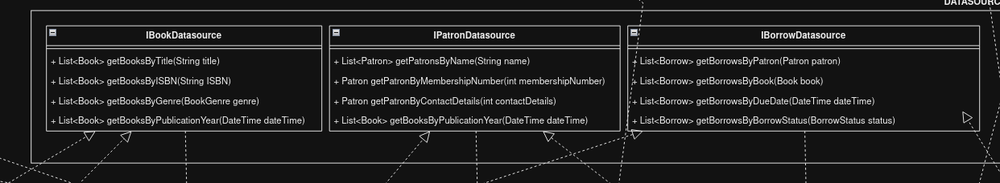
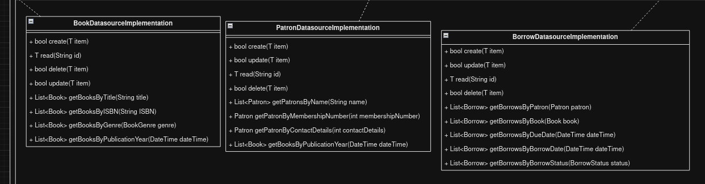
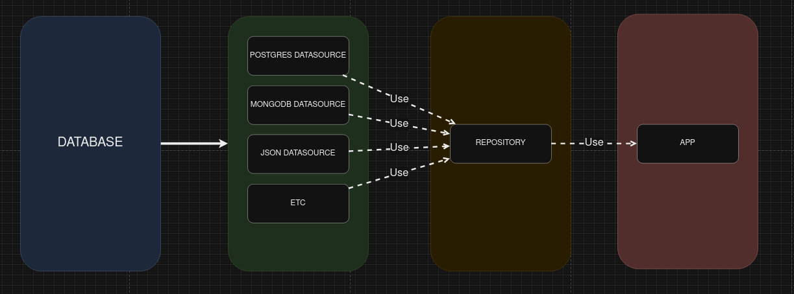

# Explicación del UML

Este archivo markdown esta hecho para explicar un poco mas a profundidad las elecciones que tuvimos como equipo al momento de crear nuestro UML. 

Explicaremos a grandes rasgos los patrones que aplicamos.

# Patron arquitectonico

Para la realizacion del UML estuvimos analizando el proyecto que escogimos y nos dimos cuenta de varios detalles, uno de estos es que podemos aplicar una estructura DDD (domain, driven, design), ya que las capas que esta estructura nos ofrece es aplicable al proyecto y de esta forma tendremos un codigo reutilizable y mantenible donde podremos aplicar patrones de diseño, y tambien podremos aplicaremos las reglas del clean code, open close, alta cohesion y bajo acoplamiento, entre otras.
A continuacion mostraremos un ejemplo de las capas que seguira nuestro proyecto:

Como vemos en la imagen el usuario se comunicara con la capa de presentacion, dicha capa de presentacion estara comunicado con la capa de infraestructura que tendra la logica que seguira nuestra aplicasion, y la capa de infraestructura estara comunicada con la capa de dominio, la cual tendra nuestras entidades e interfaces que definiran nuestro contrato (interfaces que si o si tendran que ser aplicadas, etc).

En resumen tomamos la desicion de aplicar ese patron arquitectonico ya que podremos tener un mejor codigo el cual sera mantenible y reutilizable, tendremos un proyecto ordenado el cual sera de facil entendimiento y tambien, dentro del equipo, podremos tener tareas menos dependientes y con mayor peso en nuestro tablero.

# Patrones de diseño

Los patrones que utilizamos son los siguientes:

## Strategy Pattern

Aplicamos strategy para el comportamiento que tendran nuestro repositories y nuestros datasources.
Ya que tendremos solo un repository que pedira un datasource como variable, y este datasource es una interfaz el cual debera ser implementada en cada datasource que nos creemos, podremos pasarle cualqueira de estas a nuestro repository

Como vemos mi repository necesita de un datasource, mientras que mi datasource es una interfaz.

## Factory Pattern

Hacemos uso del patron factory para la creacion de nuestros datasource, ya que definimos en nuestro domain, la interfaz que debera seguir cada datasource que creemos en un futuro. Cada datasource realizara la misma tarea (en este caso la comunicacion con la base de datos) pero a su manera.
Un ejemplo es el siguiente:

Donde podremos tener multiples datasource los cuales tendran que implementar la interfaz en comun.
Esto es muy importante dentro la aplicacion y se vera el porque cuando hablemos del bridge.

## Bridge Pattern
Hacemos uso del patron bridge para la comunicacion del datasource con el repository, ya que estas son clases estrechamente relacionadas y las dividimos en dos jerarquias separadas.

Un ejemplo es el siguiente:

Donde vemos que mi repository hace uso del datasource en forma de puente, mientras que todos los datasource que vaya a yo crear siguen una interfaz en comun y puedo pasarle cualquiera de estos datasource a mi repository.

El motivo de esta estructura se detallara al momento de hablar del datasource y repository pattern

## Datasource and Repository Pattern

Este es un patron clave para nuestra arquitectura DDD ya que podremos abstraer la logica del negocio de la fuenta de datos. Esto nos sirve para tener un codigo mucho mas mantenible, ya que el momento en que queramos cambiar de fuente de datos, podremos hacerlo de una forma sencilla y facil, solo implementando la interfaz datasource, mientras que solo tendremos un repository que sera el intermediario entre nuestra UI y el Datsource.

De esta forma al momento de cambiar de fuente de datos no tendremos que hacer grandes cambios al codigo, simplemente deberia pasarle el datasource a mi repository y ahi terminaria mi trabajo, no tendria que tocar nada de la UI. (A menos que cambie la logica del negocio a grandes rasgos)

Un ejemplo de este patron puede ser el siguiente:

Donde se detalla lo anteriormente mencionado, tendremos una base de datos X, tendre datasources que sabran como comunicarse con esa base de datos, puedo tener multiple datasources para cada base de datos, ese datasource se lo pasara al repository que sera UNICO y el repository comunicara a la APP con la informacion solicitada

Esta parte no necesita una imagen de ejemplo porque se ve reflejado en gran parte de nuestro UML
