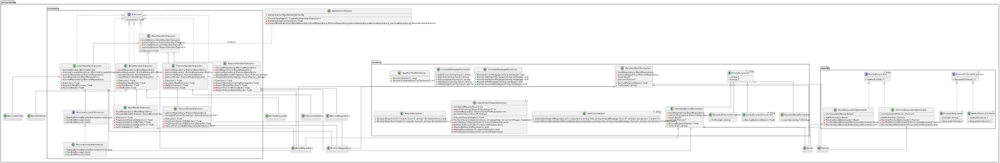

# Option 1 - Library Management System

By Borbotones Team:
- Ruth Bianca Soliz 
- Diego Figueroa
- Samuel Escalera

Related Features in [Docs](https://drive.google.com/file/d/1-JL5HrP4XCGChKNjJDCH6o6TwO9xqdNo/view?usp=sharing)

Dashboard in [Trello](https://trello.com/b/BQ6Nl42q/progra-6-los-borbotones)

## Prerequisites

Before getting started, make sure you have the following installed:

- [Docker](https://www.docker.com/get-started)

## Docker Compose

To be able to create the database, just run the following command:
```
docker compose up -d
```
This will not only create a docker container with postgres as the database, but it will also create the tables and fill them

---
# New Team - FakeOrgasm
__Team members__:

- Axel Javier Ayala Siles
- Gabriel Santiago Concha Saavedra
- Luiggy Mamani Condori
- Salet Gutierrez Nava
---
__Workspace__

- For progress tracking and task management, please visit our [Taiga](https://tree.taiga.io/project/santiago_c_saavedra-fakeorgasm/taskboard/sprint-2-12683)
---
__Docs__

- [Observations and Enhancement document - FakeOrgasm](https://docs.google.com/document/d/1vNPznRAD0DpJuhCdCQYmk_fweOOlfJl5AA6nGSVpRyg/edit)
- [Branch and Commit Naming Convention](https://tree.taiga.io/project/santiago_c_saavedra-fakeorgasm/wiki/branch-and-commit-naming-convention)

__Class Diagrams__
## Domain

## Infraestructure

## Presentation


---
## Enhancements or errors that will be worked on
### Luiggy Mamani

- [Improving cohesion and delegation of responsibilities for Searches](https://tree.taiga.io/project/santiago_c_saavedra-fakeorgasm/us/56?milestone=403375) | __Status__ "DONE"
- [Editing Implementation for Books and Patrons](https://tree.taiga.io/project/santiago_c_saavedra-fakeorgasm/us/43?milestone=403375) | __Status__ "DONE"
- [Refactoring of executors](https://tree.taiga.io/project/santiago_c_saavedra-fakeorgasm/us/66?milestone=403375) | __Status__ "DONE"
- Change the data type of Contact Details to String | __Status__ "REJECTED"
     + It was rejected because the other team thought to save phone number

### Axel Ayala
- [Eliminate interface redundancy for book management](https://tree.taiga.io/project/santiago_c_saavedra-fakeorgasm/us/46?milestone=403375) | __Status__ "DONE"
- [Improve entities validations and exceptions](https://tree.taiga.io/project/santiago_c_saavedra-fakeorgasm/us/60?milestone=403375) | __Status__ "DONE"

### Salet Gutierrez
- [Borrow made by a user are not saved in the database](https://tree.taiga.io/project/santiago_c_saavedra-fakeorgasm/us/37?milestone=403375) | __Status__ "DONE"
- [Delete sensitive data from the program](https://tree.taiga.io/project/santiago_c_saavedra-fakeorgasm/us/63?milestone=403375) | __Status__ "DONE"
- [Return book to library](https://tree.taiga.io/project/santiago_c_saavedra-fakeorgasm/us/79?milestone=403375) | __Status__ "DONE"
- [Implement Logging with Serilog](https://tree.taiga.io/project/santiago_c_saavedra-fakeorgasm/us/74?milestone=403375) | __Status__ "DONE"

## Santiago Concha
- [Update UML](https://tree.taiga.io/project/santiago_c_saavedra-fakeorgasm/task/65) | __Status__ "DONE"

---
## Architecture and Design Patterns

### Architecture

The `Los Borbotones` team documented the use of a domain-driven architecture, known as **Domain-Driven Design (DDD)**. This architecture was largely respected by the `FakeOrgasm` team, maintaining the three main layers:

- **PRESENTATION**: Manages the user interface and interaction.
- **INFRASTRUCTURE**: Handles communication with the database and other external services.
- **DOMAIN**: Contains the core business logic and domain rules.

### Original Design Patterns

In the original documentation provided by the `Borbotones team`, several design patterns were mentioned as being used in their project. However, after thorough analysis, certain inconsistencies and code duplications were identified. Below is a detailed account of the original state of the design patterns and the modifications implemented:

- **Strategy Pattern**: Initially applied to manage the behavior of `repositories` and `datasources`. However, code duplication between these components was identified, leading to the decision to eliminate the `datasources`, making this pattern unnecessary in the current context.
- **Factory Pattern**: Used for the creation of `datasources`. Since `datasources` were eliminated due to code duplication, this pattern also became inapplicable.
- **Bridge Pattern**: Applied to connect `datasources` with `repositories`. With the removal of `datasources` due to duplication and poor interface design, this pattern also became unnecessary.
- **Command Pattern**: Mentioned for use in search logic and report generation. However, this pattern was not actually implemented in the original project, so it was not considered during the improvements.
- **Datasource and Repository Pattern**: The `Datasource` pattern was eliminated, but the `Repository` pattern was retained, ensuring the abstraction of business logic from the data source.
- **Singleton Pattern**: Applied to ensure a single instance of the `repositories`. This pattern was removed as it was deemed unnecessary in this context. Additionally, it was considered that it could become a bottleneck if larger data volumes were handled in the future. It was replaced by `Dependency Injection` for better control and flexibility.

### Design Patterns Applied After the Improvements
During the implementation of improvements, the `FakeOrgasm` team applied the following design patterns:

- **Strategy Pattern**: 
     - **Reason for implementation**:
          There was a lot of repetitive code, especially in handling data searches such as books, patterns and loans by pagination. With strategy, the behavior was abstracted in method signatures and a Context was used that uses the strategies injected by the client to render the results with pagination.
          This approach helps reduce repetitive code and is flexible to implementations that follow the interface signature.
     - **How ​​it was implemented**:
          1. **Behavior abstraction:** The logic of requesting the search criteria and the logic of requesting this data with pagination are in the interfaces `ISearchCriteriaRequester<I>` and `ISearchStrategy<T, I>`. One is in the _application layer_ (interface with the application logic to obtain data by pagination) and the other in the _presentation layer_ (to obtain the search criteria where there may be an interaction with the client).
          2. **Concrete implementations** for search criteria and ways to retrieve data by pagination.
          3. **Context Creation:** `UserDrivenPagedSearcher<T, I>` acts as a context that orchestrates the use of strategies to execute the paginated search. This context handles user interaction, such as moving to the next page or stopping the search, ensuring that pagination logic is handled consistently throughout the application.
          4. **Using the context with strategies from the client** from the controllers or executors of the handlers when searching for books, patterns or reports.
- **Facade Pattern**:
     - **Reason for implementation**:
          To simplify the initialization and coordination of complex components like repositories, services, and executors. The Facade Pattern provides a clean interface, reducing the client code's complexity.
     - **How it was implemented**:
          1. **Facade Creation:** The ApplicationFacade class encapsulates the setup of the database connection, repositories, services, and executors.
          2. **Streamlined Setup:** The CreateAppAsync method initializes all necessary components and returns a _MainHandlerExecutor_ for immediate use, hiding the underlying complexity.
          3. **Client Usage:** The facade is used in the main program to start the application with minimal setup, keeping the client code simple.

#### Special mention to Principles and techniques used:
- **Interface Segregation Principle (ISP)**: The need for this principle was identified due to poorly defined interfaces that forced classes to implement unnecessary methods or perform multiple responsibilities. Changes were made to adhere to the principle of interface segregation, improving cohesion and reducing coupling.
- **Dependency Injection**: Dependency injection was implemented to replace the use of `Singleton` and `static` values in the database connection. This allowed for better management of dependencies within the `repositories` and prevented the exposure of sensitive values through static variables.